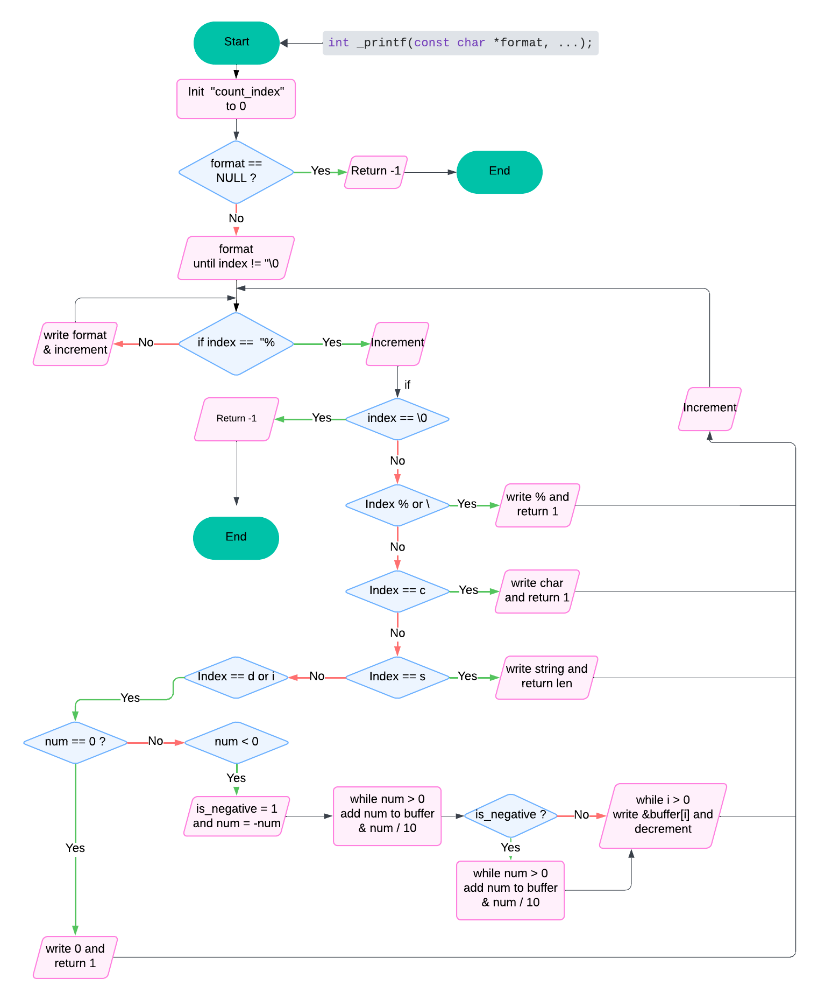

# C - Printf Project
### The printf function, print a argument(s) in the formatted output to the standard output "stdout".

---
## Compilation Command:
Using `Ubuntu 20.04 LTS` to compile the program using `gcc`, with the option `-Wall -Werror -Wextra -pedantic -std=gnu89 -Wno-format *.c`.

## Requirement:
- `Ubuntu 20.04 LTS` Environment.
- `gcc` GNU Compiler Collection.
- [`betty`](https://github.com/hs-hq/Betty/tree/main) Coding Style Checker.

## Usage Example:
**main.c file:**
``` c
#include "main.h"
/**
 * main - Entry point
 * Return: Always 0
 */
int main(void)
{
	// Declare and Initialize the string "str"	
	char str[] = "World !";

	// Using the _printf function to print the string.
	_printf("Hello %s\n", str);
}
```
**Compile and run the program on Ubuntu 20.04 LTS:**
``` shell 
user@ubuntu: gcc -Wall -Wextra -Werror -pedantic -std=gnu89 -Wno-format *.c
user@ubuntu: ./main.c
Hello World!
user@ubuntu: 
```

## Testing:


## Flowchart:


### Author:
- [Shaan Somarchand](https://github.com/theTropicalBoi)
